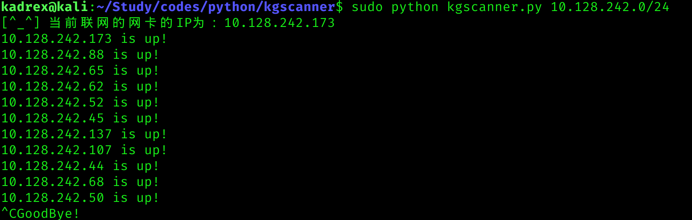

# 简介
这是一款简单的扫描工具,可以确认子网中有多少主机是存活的  
# 示例
  

  
# 技术细节
通过在子网中发送udp包的形式，来确认子网中有多少主机是存活的  
如果主机回应了一个ICMP的code为3且类型为3的包（代表端口不可达），则我们将其标记为存活  
另外，我们通过设置在UDP包中插入一段8字节的数据，相应的ICMP包会在包的末尾加上这段8字节的数据，从而验证我们所嗅探到的ICMP包是否对应我们所发的UDP包  
## struct库
这是本工具主要依赖的库，可以解码二进制数据，将数据包的IP头部和ICMP头部解码为人类可读的形式  
## RAW套接字
我们使用socket库创建了SOCK\_RAW套接字，该套接字是原始套接字，可以直接嗅探IP数据包，同时我们使用`socket.setsockopt(socket.IPPROTO_IP, socket.IP_HDRINCL, 1)`的方式设置我们的原始套接字，使其嗅探到的包携带IP头部  
## ipaddress库
该库帮我们将子网如`166.166.1.0/24`的格式分开成多个ip地址的格式，从而方便我们使用sokcet发送、接收数据。  
## Windows vs. Linux
在使用原始套接字嗅探包时，需要将网卡开启为监听模式，Linux在使用原始套接字时会自动开启监听模式（前提是你用root的权限运行该程序），而Windwos需要弹出一个IOCTL信息，用户需要主动确认，才能打开网卡的监听模式。  
同时，若Windows打开了监听模式，则原始套接字可接受任意运输层协议的包，但Linux必须指定你要接受那一种运输层协议的包，比如UDP、TCP、ICMP  

